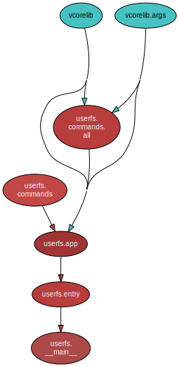

<!--
    =====================================
    generator=datazen
    version=3.1.2
    hash=ae6d8345565af8ac9b349c7b95f5091c
    =====================================
-->

# userfs ([1.0.2](https://pypi.org/project/userfs/))

[](https://pypi.org/project/userfs/)

[](https://codecov.io/github/vkottler/userfs)


*A system-bootstrapping automation and introspection tool.*

See also: [generated documentation](https://vkottler.github.io/python/pydoc/userfs.html)
(created with [`pydoc`](https://docs.python.org/3/library/pydoc.html)).

## Python Version Support

This package is tested with the following Python minor versions:

* [`python3.7`](https://docs.python.org/3.7/)
* [`python3.8`](https://docs.python.org/3.8/)
* [`python3.9`](https://docs.python.org/3.9/)
* [`python3.10`](https://docs.python.org/3.10/)
* [`python3.11`](https://docs.python.org/3.11/)

## Platform Support

This package is tested on the following platforms:

* `ubuntu-latest`
* `macos-latest`
* `windows-latest`

# Introduction

# Command-line Options

```
$ ./venv3.11/bin/ufs -h

usage: ufs [-h] [--version] [-v] [-C DIR] {build,custom,fetch,noop} ...

A system-bootstrapping automation and introspection tool.

options:
  -h, --help            show this help message and exit
  --version             show program's version number and exit
  -v, --verbose         set to increase logging verbosity
  -C DIR, --dir DIR     execute from a specific directory

commands:
  {build,custom,fetch,noop}
                        set of available commands
    build               attempt to build a software project from its sources
    custom              perform a custom interaction, sourced from external
                        hooks
    fetch               attempt to obtain some software from the internet
    noop                command stub (does nothing)

```

## Sub-command Options

### `build`

```
$ ./venv3.11/bin/ufs build -h

usage: ufs build [-h] [-c CONFIG] [-a] [-n] [-p PATTERN] [-d] [projects ...]

positional arguments:
  projects              specific projects to build, arguments in the form
                        'key=value' will be provided as interaction options

options:
  -h, --help            show this help message and exit
  -c CONFIG, --config CONFIG
                        an optional path to the configuration directory
  -a, --all             interact with all configured projects
  -n, --no-interact     don't run package-implemented interactions
  -p PATTERN, --pattern PATTERN
                        a pattern to use to select project specifications
                        filtered by name
  -d, --deploy          whether or not to also attempt to deploy or install
                        the built project assets

```

### `custom`

```
$ ./venv3.11/bin/ufs custom -h

usage: ufs custom [-h] [-c CONFIG] [-a] [-n] [-p PATTERN] [projects ...]

positional arguments:
  projects              specific projects to build, arguments in the form
                        'key=value' will be provided as interaction options

options:
  -h, --help            show this help message and exit
  -c CONFIG, --config CONFIG
                        an optional path to the configuration directory
  -a, --all             interact with all configured projects
  -n, --no-interact     don't run package-implemented interactions
  -p PATTERN, --pattern PATTERN
                        a pattern to use to select project specifications
                        filtered by name

```

### `fetch`

```
$ ./venv3.11/bin/ufs fetch -h

usage: ufs fetch [-h] [-c CONFIG] [-a] [-n] [-p PATTERN] [-u] [projects ...]

positional arguments:
  projects              specific projects to build, arguments in the form
                        'key=value' will be provided as interaction options

options:
  -h, --help            show this help message and exit
  -c CONFIG, --config CONFIG
                        an optional path to the configuration directory
  -a, --all             interact with all configured projects
  -n, --no-interact     don't run package-implemented interactions
  -p PATTERN, --pattern PATTERN
                        a pattern to use to select project specifications
                        filtered by name
  -u, --update          whether or not to also attempt to update project
                        sources

```

# Internal Dependency Graph

A coarse view of the internal structure and scale of
`userfs`'s source.
Generated using [pydeps](https://github.com/thebjorn/pydeps) (via
`mk python-deps`).


